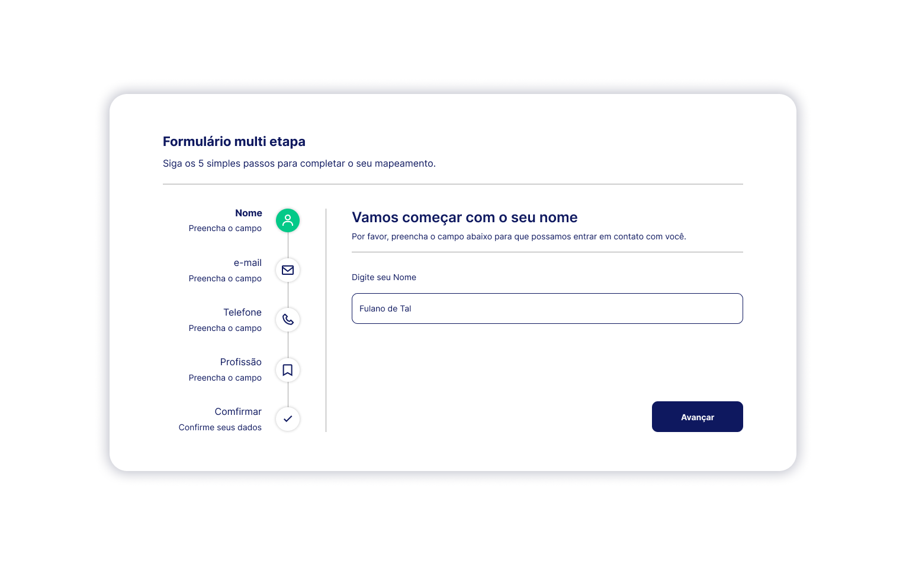

# Multi Step Form

Um formulário multi etapa desenvolvido com React.

## Tecnologias Utilizadas

- React
- JavaScript
- HTML
- CSS
- Git

## Funcionalidades
- Divisão do formulário em múltiplas etapas, facilitando a navegação e a compreensão do processo de preenchimento.
- Validação dos campos em cada etapa, garantindo a integridade dos dados fornecidos pelo usuário.
- Armazenamento dos dados fornecidos pelo usuário, permitindo o envio completo do formulário no final do processo.
#

[LInk para Página](https://jonassjr.github.io/Multi-step-form/)
